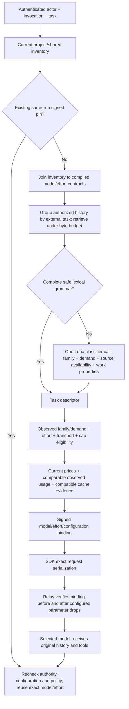

# V12 implementation contract

V12 is a provisional Auto candidate, behind the existing platform/project gates.
Manual selections and pipelines retain their existing behavior. This change
adds measured effort selection and improves the existing CPU/classifier path;
it does not add online judges, embeddings, a GPU service or database tables.

## Data path



## Calibrated contracts

`scripts/compile_v12_candidate.py` verifies the sealed V11 observation SHA and
produces `v7/calibration-v12.json`. It does not read judgments during inference.
There are 20 measured presets (five models × default/low/medium/high), 400
family/preset cells, and 248 provisional all-pass family cells. These replace
the five V9 defaults; eight earlier presets remain, giving 28 variants across
ten exact model identities. Project discovery still decides what is available.

Eligibility requires **all original tasks in the family to pass**, at least three
samples, and the exact observed demand band. Original 1,278 pass /210 fail /12
unknown outcomes remain unchanged. Targeted regrades and supplementary recovered
code checks do not grant eligibility. Three/four samples per cell are inadequate
for a population success guarantee. `production_promotion_allowed` remains false.

Signed config gains `routing_reasoning_fields`. It is an exact transport contract:

| Measured preset | Request fields |
|---|---|
| Provider default | No reasoning/thinking fields |
| Terra/Sol explicit | `reasoning: {effort: low/medium/high}` on Chat Completions |
| Native Opus explicit | `thinking: {type: adaptive, display: summarized}` and `output_config: {effort: low/medium/high}` on Messages |

The SDK preserves those shapes even when worker defaults prefer another API.
Aliases, extra thinking budgets, contradictory effort, a smaller unmeasured cap,
or parameter-drop settings that would alter the signed envelope reject dispatch.
Manual calls keep their current parameter handling. The measured allowance is
32,000 total output tokens, including thinking; it is neither an expected spend
nor a promise of a complete answer. Realized effort was not reported by providers.
Native observations do not qualify compatible-mode Anthropic reasoning.

## Context algorithm

`v7/retrieval.py` now uses the same incremental index for plain and tool history.
It groups each actual external user turn with its assistant/tool trajectory,
ranks groups using BM25 over query-relevant excerpts, and keeps source anchors
ahead of optional similar material. The optional group bound is budget-derived
(4–64), replacing the plain-history 12-entry cutoff. The default payload budget
remains 24 KB; the public internal bound remains 6–64 KB. This is not an unbounded
history expansion. Index limits remain 4,096 entries and 8 MB.

A unique old-topic return omits an unrelated intervening joke. An unanchored short
follow-up keeps the latest complete group for interpretation. Explicit pending
sources and active instructions remain provenance-bearing inputs. Budgeting
clips excerpts, then removes whole optional groups. Required groups win over
unrelated matches. If a required group still cannot fit, the view records
`required_source_coverage.status=unavailable`, clears unavailable reference IDs,
and selects the conservative generation path without a classifier call. Full
generation history is unchanged. No fabricated answer or clarification is emitted.

The final bounded view is the reference-resolution authority, including after
trusted retrieval metadata is added. A previous proposal cannot keep a dangling
source ID. Classifier counts distinguish local abstention from an actual call.

## Task properties and lexical admission

The same classifier request now asks for `work_profile`:

| Dimension | Values |
|---|---|
| work | lookup, explain, transform, create, design, implement, debug, verify |
| reasoning | bounded, multi_step, interacting_constraints |
| evidence | ordinary, supplied, retrieve, conflicting |
| creativity | none, constrained, open |
| verification | none, check, prove |

Strict enum validation applies when the profile is returned. Existing descriptors
without it retain their behavior. Interacting constraints or proof raise the
demand floor to deep; multiple dependent steps or conflicting evidence raise it
to standard. Nothing lowers an existing demand or treats creativity alone as
expensive. These are conservative rules, **not calibrated per-property capability
scores**. Missing or invalid evidence cannot create model eligibility.

The lexical extension recognizes only complete bounded ASCII case transforms
and sorting 2–32 bounded integers. It abstains for appended tasks, references to
earlier artifacts, authored agent requirements, unsupported scripts or larger
inputs. It determines a descriptor, never the answer. General knowledge, weather
and engineering still require classification unless an existing safe rule applies.
Sparse/embedding similarity is not sufficient proof of cheap-task eligibility.

## Cost and cache ranking

Eligibility always precedes price. Current platform Costs entries remain the
price authority. The compiler optionally verifies the original generation hashes
and exports per-call input/byte ratios, observed output distribution and calls
per scored task. Earlier setup turns are excluded; tools within the task count.
Unknown or failed call usage prevents a usage profile.

Empirical ranking is allowed only when **every eligible competitor** has at least
three tasks and the current input size lies in its observed range. It uses the
measured token/byte ratio, observed p90 output, and p90 call count. The cap remains
unchanged for context admission and dispatch. If any candidate lacks support or
its forecast tier is unpriced, every candidate falls back to the conservative
byte/cap scenario. Legacy cohorts often cause this fallback; missing usage is
not free or a reason to prefer another provider. Small-sample p90 is a descriptive
statistic, not a validated prediction guarantee.

Cache evidence must match route, model, effort, tools, cap, request prefix, epoch
and TTL. Only explicit numeric read metrics enter the historical hit/miss count;
absent/null metrics remain unknown. Write-only observations can bound a possible
cached prefix but do not invent a read rate. At least three compatible reported
reads/misses allow a historical cold/read mixture in ranking. Cold upper quotes
and the `[0,1]` future hit-probability range remain visible. Hidden provider
eviction/routing remains uncertain. Restoring a durable checkpoint starts cold.

The previous variant breaks exact-cost ties only. There is no arbitrary 5%
premium for staying on a model. Pinning still prevents changes inside an active
run; the ranking executes only at a new routing boundary.

## Rollout and remaining gates

Install Gateway and SDK together after draining Auto runs. Existing policy pins
reject with409; new invocations resolve normally. Keep V9 compilation available
for historical replay; rollback requires reverting both source changes and
restarting processes. No migration is needed.

Source tests and mocked serialization establish implementation contracts. Paired
local classification checks and real answers establish local execution only.
Next gates are a frozen held-out comparison covering the new properties and
retrieval edge cases, usage-forecast coverage/error measurement, native Anthropic
integration in the dev product, provider-stratified opportunity analysis, and
human acceptance. No new quality/cost percentage is implied by this implementation.

```sh
python scripts/compile_v12_candidate.py \
  --observations routing/v7/calibration-v11-observations.json \
  --source-root /path/to/model-efforts-v11 --output routing/v7/calibration-v12.json
for file in tests/test_*.py; do
  python -m pytest --rootdir=tests --confcutdir=tests "$file" -q || exit
done
```
